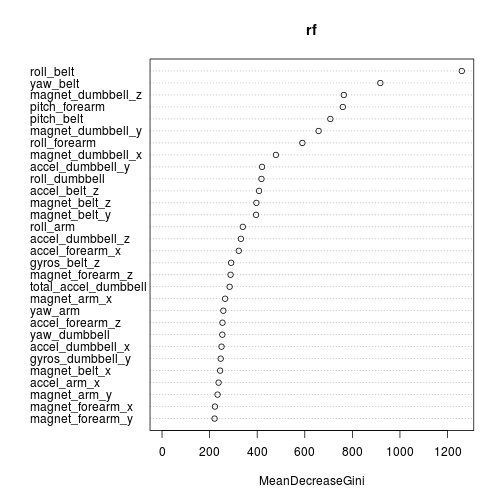

# Practical machine Learning: Project

## Synopsis

The goal of this project is to classify type of physical activity using Random Forest algorithm with data from wearable accelerometers. More information is available at:

https://class.coursera.org/predmachlearn-003

http://groupware.les.inf.puc-rio.br/har

## Data Cleaning

Preliminary data exploration showed that there are some number of empty data cells or cells filled with #DIV/0!". This fact is taken into account during reading of train and test data:


```r
library(randomForest)
train <- read.table("pml-training.csv",header=TRUE,sep=",", na.strings = c("NA","","#DIV/0!"))
test <- read.table("pml-testing.csv",header=TRUE,sep=",", na.strings = c("NA","","#DIV/0!"))
```

## Feature Selection

Further, data columns with at least one NA value were discarded:


```r
cols <- c()
for (col in colnames(train)) {
  if (!any(is.na(train[col]))) cols <- c(cols, col)
}
```

Finally, data columns which identify uniquely either the sibject ot the measurement moment were also discarded in order to avoid possible overfitting:


```r
cols <- cols[! cols %in% c("X","user_name","raw_timestamp_part_1","raw_timestamp_part_2","cvtd_timestamp","new_window","num_window")]
train <- train[cols]
```

## Model Building

Random Forest algorithm with default settings was used as a classifier:


```r
rf <- randomForest(classe ~ ., data=train)
predict(rf,newdata=test)
```

```
##  1  2  3  4  5  6  7  8  9 10 11 12 13 14 15 16 17 18 19 20 
##  B  A  B  A  A  E  D  B  A  A  B  C  B  A  E  E  A  B  B  B 
## Levels: A B C D E
```

## Error estimation

One of the nice features of Random Forest algorithm is that error rate can be estimated from out-of-bag (OOB) samples:


```r
print(rf)
```

```
## 
## Call:
##  randomForest(formula = classe ~ ., data = train) 
##                Type of random forest: classification
##                      Number of trees: 500
## No. of variables tried at each split: 7
## 
##         OOB estimate of  error rate: 0.29%
## Confusion matrix:
##      A    B    C    D    E class.error
## A 5578    1    0    0    1   0.0003584
## B   11 3783    3    0    0   0.0036871
## C    0   11 3410    1    0   0.0035067
## D    0    0   21 3193    2   0.0071517
## E    0    0    2    3 3602   0.0013862
```

The error rate estimated this way is 0.3%

## Feature importances


```r
varImpPlot(rf)
```

 
